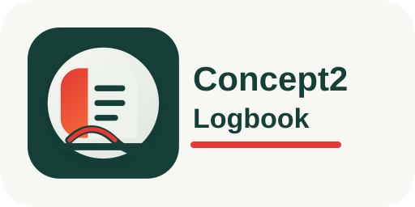

# Concept2 Logbook Home Assistant Integration

Custom Home Assistant integration for the Concept2 Logbook API.

## Features

- Adds one Concept2 Logbook user per access token.
- Validates the token during setup and prevents duplicate users.
- Lets you replace the access token later from the integration options.
- Polls the latest workout.
- Exposes summary sensors for selectable periods and workout types.

## Installation

### HACS custom repository

1. Open HACS in Home Assistant.
2. Go to Integrations.
3. Open the three-dot menu and choose Custom repositories.
4. Add `https://github.com/gickowtf/concept2logbook` as an Integration
   repository.
5. Install `Concept2 Logbook`.
6. Restart Home Assistant.

Repository: `gickowtf/concept2logbook`

### Manual installation

Copy `custom_components/concept2logbook` into your Home Assistant
`custom_components/concept2logbook` directory and restart Home Assistant.

The integration depends on `pyconcept2==0.1.0`. Home Assistant installs it from
the integration manifest if the package is available to the Home Assistant
environment.

## Setup

1. Create a Concept2 access token with `user:read` and `results:read` scopes.
2. In Home Assistant, go to Settings > Devices & services.
3. Add the `Concept2 Logbook` integration.
4. Enter the access token and choose a scan interval.

The options dialog lets you change the scan interval, replace the access token,
choose summary periods, and choose workout types. A replacement token must belong
to the same Concept2 Logbook user.

## Sensors

- Last workout
- Last workout distance
- Last workout time
- Last workout calories
- Last workout stroke rate
- Last workout pace
- Last workout drag factor
- Last workout type
- Last workout source
- Last workout verified
- Last workout ranked
- Profile
- Last successful update
- Workout count
- Total distance
- Total time
- Total calories

Summary sensors can be created for all time, current year, current month, last
year, last month, last 30 days, last 7 days, and the Concept2 season. They can
be split by all workout types, RowErg, SkiErg, and BikeErg.

